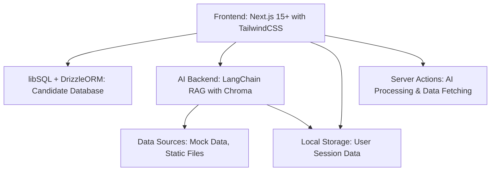

# Master Index: AI-Driven Voting Decision Webapp Prototype

## Overview
This prototype is a webapp that helps users decide who to vote for by matching their preferences with candidates/parties through an interactive, AI-driven process. It uses a generic approach with mock data initially, allowing for easy adaptation to specific elections.

## Starting Point
This project starts from a Next.js 15 starter template located in the `lib-voter/` directory. The template includes:
- Next.js 15 with App Router
- TypeScript configuration
- TailwindCSS for styling
- Basic project structure

## Architecture Overview


## Technology Stack
- **Frontend**: Next.js 15+, TailwindCSS, shadcn/ui
- **Backend**: libSQL + DrizzleORM (Candidate Database), LangChain (RAG), Chroma (Vector DB)
- **Runtime**: Bun (instead of npm)
- **Version Control**: Jujutsu (jj) instead of git
- **Deployment**: Vercel
- **Data**: Mock data initially, static files only (no external APIs)
- **State Management**: React state + localStorage for session persistence
- **API**: Next.js ServerActions (preferred over API routes for prototype)
- **Development Tools**: Follow rules in `.kilocode/rules/`

## File Dependencies
- `01_typescript_schemas.md`: Defines type system and schemas
- `02_database_setup.md`: Defines libSQL + DrizzleORM data storage with bun/jj workflow
- `03_rag_backend.md`: Defines RAG pipeline with server-client separation
- `04_ai_chat_system.md`: Defines AI interaction logic with confidence scoring
- `05_ui_left_side.md`: Defines dynamic input components with mobile behavior
- `06_ui_right_side.md`: Defines candidate display with confidence indicators
- `07_ai_prompt_library.md`: Defines AI prompt management system
- `08_environment_variables.md`: Defines required environment configuration

## Implementation Order
The features should be implemented in the following order to ensure proper dependencies:

1. [TypeScript Schemas](01_typescript_schemas.md) - Type system foundation
2. [Database Setup](02_database_setup.md) - libSQL + DrizzleORM data storage foundation
3. [AI Prompt Library](07_ai_prompt_library.md) - AI infrastructure setup
4. [RAG System and Data Integration](03_rag_backend.md) - Data processing layer
5. [AI Chat and Dynamic Questions](04_ai_chat_system.md) - Core AI functionality
6. [UI Left Side (Dynamic Inputs)](05_ui_left_side.md) - User input interface
7. [UI Right Side (Candidate Matching Display)](06_ui_right_side.md) - Results display
8. [Environment Variables](08_environment_variables.md) - Configuration setup

## Development Workflow
Each implementation step should follow these guidelines:

### Package Management
- Use `bun` instead of `npm` for all package operations
- Install dependencies: `bun add <package>`
- Run scripts: `bun run <script>`

### Version Control
- Use `jj` (Jujutsu) instead of git
- After each major implementation step, commit changes:
  ```bash
  jj describe -m "Implement [feature name]"
  jj new
  ```

### Code Architecture
- Follow server-client separation rules in `.kilocode/rules/server-client-rules.md`
- Use Server Actions instead of API routes
- Keep server-only code in `src/lib/server/`
- Keep client-safe code in `src/lib/client/`

### Implementation Steps Structure
Each feature implementation includes:
- **Dependencies**: Required packages to install with bun
- **File Structure**: Complete file paths and organization
- **Code Implementation**: Self-contained code snippets
- **Integration Points**: How it connects to other features
- **Testing**: Basic verification steps
- **Commit Instructions**: When to commit with jj

## Integration Points
- All components communicate via React state and local browser storage
- AI responses are auto-saved to localStorage to prevent data loss on page reload
- Data flows from RAG system to frontend via ServerActions with response caching
- User session data is managed entirely in browser localStorage
- Confidence-based progressive disclosure: candidates shown when AI_CONFIDENCE_THRESHOLD reached
- Mobile-responsive: left/right panels collapse based on active section

## Security & Privacy
- Fully anonymous usage (no user identification required)
- No personal data collection or server-side storage
- User session data stored locally in browser only
- GDPR/CCPA compliant by design (no data transmission)
- No user tracking or profiling capabilities

## Next Steps
After reviewing this plan, switch to Code mode for implementation.
After each implementation step, commit the changes via jj.