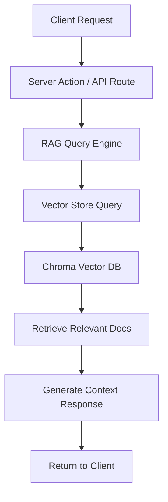

# RAG System and Data Integration

## Overview
The RAG (Retrieval-Augmented Generation) system integrates static data sources, maintains a knowledge base using Chroma vector database, and provides context-aware responses. It uses LangChain for orchestration with pre-loaded candidate and policy data.

## Dependencies
```bash
# Install LangChain and Chroma packages
bun add langchain @langchain/openai @langchain/community chromadb
bun add -d @types/node

# Note: Chroma requires Python and should be run separately
# Install Chroma: pip install chromadb
```

## Implementation Steps

### 1. Create Server-Only RAG Infrastructure
Following server-client separation rules, all RAG operations must be server-side only:

**File: `voting-advisor/src/lib/server/rag/vector-store.ts`**
```typescript
// Server-only: Cannot be imported in client components
import { Chroma } from '@langchain/community/vectorstores/chroma';
import { OpenAIEmbeddings } from '@langchain/openai';
import { RecursiveCharacterTextSplitter } from 'langchain/text_splitter';
import { DirectoryLoader } from 'langchain/document_loaders/fs/directory';
import { JSONLoader } from 'langchain/document_loaders/fs/json';
import { TextLoader } from 'langchain/document_loaders/fs/text';
import path from 'path';

class VectorStoreManager {
  private vectorStore: Chroma | null = null;
  private embeddings: OpenAIEmbeddings;

  constructor() {
    this.embeddings = new OpenAIEmbeddings({
      openAIApiKey: process.env.OPENAI_API_KEY!,
      modelName: 'text-embedding-3-small'
    });
  }

  async initialize() {
    try {
      // Try to load existing collection
      this.vectorStore = await Chroma.fromExistingCollection(
        this.embeddings,
        {
          collectionName: 'candidates',
          url: process.env.CHROMA_URL || 'http://localhost:8000'
        }
      );
      console.log('✅ Loaded existing vector store');
    } catch (error) {
      // Create new collection if it doesn't exist
      console.log('📝 Creating new vector store...');
      await this.createVectorStore();
    }
  }

  private async createVectorStore() {
    const dataDir = path.join(process.cwd(), 'data', 'candidates');

    // Load documents from data directory
    const loader = new DirectoryLoader(dataDir, {
      '.json': (filePath: string) => new JSONLoader(filePath),
      '.md': (filePath: string) => new TextLoader(filePath),
      '.txt': (filePath: string) => new TextLoader(filePath)
    });

    const docs = await loader.load();

    // Split documents into chunks
    const splitter = new RecursiveCharacterTextSplitter({
      chunkSize: 1000,
      chunkOverlap: 200
    });

    const splitDocs = await splitter.splitDocuments(docs);

    // Create vector store
    this.vectorStore = await Chroma.fromDocuments(splitDocs, this.embeddings, {
      collectionName: 'candidates',
      url: process.env.CHROMA_URL || 'http://localhost:8000'
    });

    console.log(`✅ Created vector store with ${splitDocs.length} documents`);
  }

  async query(question: string, maxResults: number = 5) {
    if (!this.vectorStore) {
      throw new Error('Vector store not initialized');
    }

    const results = await this.vectorStore.similaritySearch(question, maxResults);
    return results.map(doc => ({
      content: doc.pageContent,
      metadata: doc.metadata,
      score: 0 // Chroma doesn't return scores by default
    }));
  }

  async addDocuments(docs: any[]) {
    if (!this.vectorStore) {
      throw new Error('Vector store not initialized');
    }

    await this.vectorStore.addDocuments(docs);
  }
}

// Singleton instance
let vectorStoreManager: VectorStoreManager | null = null;

export async function getVectorStoreManager() {
  if (!vectorStoreManager) {
    vectorStoreManager = new VectorStoreManager();
    await vectorStoreManager.initialize();
  }
  return vectorStoreManager;
}
```

### 2. Create RAG Query Engine
**File: `voting-advisor/src/lib/server/rag/query-engine.ts`**
```typescript
// Server-only RAG query engine
import { ChatOpenAI } from '@langchain/openai';
import { getVectorStoreManager } from './vector-store';
import type { Candidate, PolicyPosition } from '@/types';

export interface RAGContext {
  candidates: Candidate[];
  relevantPolicies: PolicyPosition[];
  sources: string[];
}

export class RAGQueryEngine {
  private llm: ChatOpenAI;

  constructor() {
    this.llm = new ChatOpenAI({
      modelName: process.env.AI_MODEL_LARGE || 'gpt-4',
      temperature: 0.3,
      openAIApiKey: process.env.OPENAI_API_KEY!
    });
  }

  async queryWithContext(question: string, userContext?: string): Promise<RAGContext> {
    const vectorStore = await getVectorStoreManager();
    const relevantDocs = await vectorStore.query(question, 10);

    // Extract candidate and policy information from relevant documents
    const candidates = this.extractCandidatesFromDocs(relevantDocs);
    const policies = this.extractPoliciesFromDocs(relevantDocs);

    // Generate contextual response
    const contextPrompt = `
Based on the following relevant information about candidates and their policies:

${relevantDocs.map(doc => doc.content).join('\n\n')}

${userContext ? `User context: ${userContext}` : ''}

Question: ${question}

Please provide:
1. List of relevant candidates with their key positions
2. Specific policy details that address the question
3. Sources for the information

Format as JSON with candidates, policies, and sources arrays.
`;

    const response = await this.llm.call([
      { role: 'system', content: 'You are a political analysis expert. Provide accurate, neutral information.' },
      { role: 'user', content: contextPrompt }
    ]);

    try {
      const parsed = JSON.parse(response.content);
      return {
        candidates: parsed.candidates || candidates,
        relevantPolicies: parsed.policies || policies,
        sources: parsed.sources || relevantDocs.map(doc => doc.metadata.source || 'Unknown')
      };
    } catch (error) {
      // Fallback if JSON parsing fails
      return {
        candidates,
        relevantPolicies: policies,
        sources: relevantDocs.map(doc => doc.metadata.source || 'Unknown')
      };
    }
  }

  private extractCandidatesFromDocs(docs: any[]): Candidate[] {
    // Extract candidate information from document content
    const candidates: Candidate[] = [];

    for (const doc of docs) {
      const content = doc.content.toLowerCase();

      // Simple extraction - in production, use more sophisticated NLP
      if (content.includes('candidate') || content.includes('running for')) {
        // This is a simplified extraction - you'd want more robust parsing
        const candidate: Candidate = {
          id: `candidate_${candidates.length}`,
          name: this.extractName(content),
          party: this.extractParty(content),
          profileData: {
            positions: [],
            biography: doc.content.substring(0, 200) + '...'
          },
          createdAt: new Date()
        };
        candidates.push(candidate);
      }
    }

    return candidates;
  }

  private extractPoliciesFromDocs(docs: any[]): PolicyPosition[] {
    // Extract policy positions from documents
    const policies: PolicyPosition[] = [];

    for (const doc of docs) {
      // Simple policy extraction - enhance with better NLP in production
      const content = doc.content;
      const policyKeywords = ['policy', 'position', 'stance', 'supports', 'opposes'];

      for (const keyword of policyKeywords) {
        if (content.toLowerCase().includes(keyword)) {
          policies.push({
            topic: this.extractTopic(content),
            stance: this.extractStance(content),
            details: content.substring(0, 300) + '...',
            sources: [doc.metadata.source || 'Unknown']
          });
          break;
        }
      }
    }

    return policies;
  }

  private extractName(content: string): string {
    // Simple name extraction - enhance with NLP in production
    const namePatterns = [
      /([A-Z][a-z]+ [A-Z][a-z]+)/g, // First Last
      /Candidate ([A-Z][a-z]+)/g    // Candidate Name
    ];

    for (const pattern of namePatterns) {
      const match = content.match(pattern);
      if (match) return match[0];
    }

    return 'Unknown Candidate';
  }

  private extractParty(content: string): string {
    // Simple party extraction
    const parties = ['Democratic', 'Republican', 'Independent', 'Green', 'Libertarian'];

    for (const party of parties) {
      if (content.includes(party)) return party;
    }

    return 'Independent';
  }

  private extractTopic(content: string): string {
    // Simple topic extraction
    const topics = ['economy', 'healthcare', 'education', 'environment', 'foreign policy'];

    for (const topic of topics) {
      if (content.toLowerCase().includes(topic)) return topic;
    }

    return 'General Policy';
  }

  private extractStance(content: string): string {
    // Simple stance extraction
    if (content.toLowerCase().includes('support')) return 'Supports';
    if (content.toLowerCase().includes('oppos')) return 'Opposes';
    if (content.toLowerCase().includes('favor')) return 'Favors';

    return 'Neutral';
  }
}
```

### 3. Create Server Actions for RAG Operations
**File: `voting-advisor/src/lib/actions/rag.ts`**
```typescript
'use server';

import { RAGQueryEngine, type RAGContext } from '@/lib/server/rag/query-engine';
import type { Candidate, PolicyPosition } from '@/types';

let ragEngine: RAGQueryEngine | null = null;

async function getRAGEngine() {
  if (!ragEngine) {
    ragEngine = new RAGQueryEngine();
  }
  return ragEngine;
}

export async function queryRAGContext(question: string, userContext?: string) {
  try {
    const engine = await getRAGEngine();
    const context = await engine.queryWithContext(question, userContext);

    return {
      success: true,
      data: context
    };
  } catch (error) {
    console.error('RAG query failed:', error);
    return {
      success: false,
      error: 'Failed to query knowledge base',
      fallback: {
        candidates: [],
        relevantPolicies: [],
        sources: []
      }
    };
  }
}

export async function getCandidateContext(candidateId: string) {
  try {
    const engine = await getRAGEngine();

    // Query for specific candidate information
    const context = await engine.queryWithContext(
      `Tell me about candidate with ID ${candidateId}`,
      'Looking for detailed candidate information'
    );

    // Find the specific candidate
    const candidate = context.candidates.find(c => c.id === candidateId);

    if (!candidate) {
      return {
        success: false,
        error: 'Candidate not found'
      };
    }

    return {
      success: true,
      data: {
        candidate,
        relatedPolicies: context.relevantPolicies,
        sources: context.sources
      }
    };
  } catch (error) {
    console.error('Candidate context query failed:', error);
    return {
      success: false,
      error: 'Failed to get candidate information'
    };
  }
}

export async function searchPolicies(topic: string) {
  try {
    const engine = await getRAGEngine();
    const context = await engine.queryWithContext(
      `What are the positions on ${topic}?`,
      `Searching for policy positions related to ${topic}`
    );

    return {
      success: true,
      data: {
        policies: context.relevantPolicies,
        candidates: context.candidates,
        sources: context.sources
      }
    };
  } catch (error) {
    console.error('Policy search failed:', error);
    return {
      success: false,
      error: 'Failed to search policies'
    };
  }
}
```

### 4. Create Data Directory Structure
Create the data directory structure for static files:

```
voting-advisor/data/
├── candidates/
│   ├── candidate1.json
│   ├── candidate2.json
│   └── policies.md
└── parties/
    ├── democratic-platform.md
    └── republican-platform.md
```

**Example candidate data file: `voting-advisor/data/candidates/candidate1.json`**
```json
{
  "id": "candidate_1",
  "name": "Jane Smith",
  "party": "Democratic",
  "biography": "Experienced politician with 10 years in public service...",
  "positions": {
    "healthcare": {
      "stance": "Supports universal healthcare",
      "details": "Advocates for Medicare for All system...",
      "sources": ["campaign website", "policy paper 2024"]
    },
    "economy": {
      "stance": "Progressive economic policies",
      "details": "Supports raising minimum wage to $15/hour...",
      "sources": ["economic plan document"]
    }
  },
  "experience": [
    "Mayor of Springfield (2018-2024)",
    "State Senator (2012-2018)"
  ],
  "website": "https://janesmith2024.com",
  "socialMedia": {
    "twitter": "@JaneSmith2024",
    "facebook": "JaneSmithForOffice"
  }
}
```

### 5. Create Client Hook for RAG Queries
**File: `voting-advisor/src/lib/client/hooks/useRAG.ts`**
```typescript
'use client';

import { useState } from 'react';
import type { RAGContext } from '@/lib/server/rag/query-engine';

export function useRAGQuery() {
  const [loading, setLoading] = useState(false);
  const [error, setError] = useState<string | null>(null);

  const queryContext = async (question: string, userContext?: string) => {
    setLoading(true);
    setError(null);

    try {
      const response = await fetch('/api/rag/query', {
        method: 'POST',
        headers: { 'Content-Type': 'application/json' },
        body: JSON.stringify({ question, userContext })
      });

      const result = await response.json();

      if (!result.success) {
        throw new Error(result.error || 'Query failed');
      }

      return result.data as RAGContext;
    } catch (err) {
      const errorMessage = err instanceof Error ? err.message : 'Unknown error';
      setError(errorMessage);
      throw err;
    } finally {
      setLoading(false);
    }
  };

  return {
    queryContext,
    loading,
    error
  };
}
```

### 6. Create API Route for Client Communication
**File: `voting-advisor/src/app/api/rag/query/route.ts`**
```typescript
import { NextRequest, NextResponse } from 'next/server';
import { queryRAGContext } from '@/lib/actions/rag';

export async function POST(request: NextRequest) {
  try {
    const { question, userContext } = await request.json();

    if (!question || typeof question !== 'string') {
      return NextResponse.json(
        { success: false, error: 'Question is required' },
        { status: 400 }
      );
    }

    const result = await queryRAGContext(question, userContext);

    return NextResponse.json(result);
  } catch (error) {
    console.error('RAG API error:', error);
    return NextResponse.json(
      { success: false, error: 'Internal server error' },
      { status: 500 }
    );
  }
}
```

## Data Sources
- **Static Candidate Data**: JSON/Markdown files with candidate profiles
- **Policy Documents**: Static PDFs and text files
- **Platform Data**: Party platform documents and position papers
- **Historical Data**: Archived election data and candidate records

## Architecture Flow


## Integration Points
- Provides context to AI chat system via Server Actions
- Supplies candidate data for matching algorithms
- Supports question generation with policy context
- Feeds structured data to frontend components
- All operations are server-side only for security

## Features
- Static knowledge base with Chroma vector storage
- Pre-processed candidate and policy data
- Efficient similarity search and retrieval
- Context-aware response generation
- Fallback to cached responses
- Server-client separation compliance
- Type-safe operations throughout

## Performance Considerations
- Optimized chunking for efficient retrieval (1000 chars, 200 overlap)
- Pre-computed embeddings for fast queries
- Local Chroma instance for low-latency access
- Error handling for vector store operations
- Singleton pattern for vector store manager
- Lazy initialization of RAG engine

## Testing the RAG System

### 1. Start Chroma Server
```bash
# Install Python dependencies
pip install chromadb

# Start Chroma server
chroma run --host 0.0.0.0 --port 8000
```

### 2. Test RAG Queries
```typescript
// In a Server Action or API route
const result = await queryRAGContext(
  "What are Jane Smith's positions on healthcare?",
  "User is interested in healthcare policy"
);

console.log(result.data.candidates);
console.log(result.data.relevantPolicies);
```

## Commit Instructions
After implementing the RAG system:
```bash
jj describe -m "Implement RAG system with Chroma vector store and server-client separation"
jj new
```