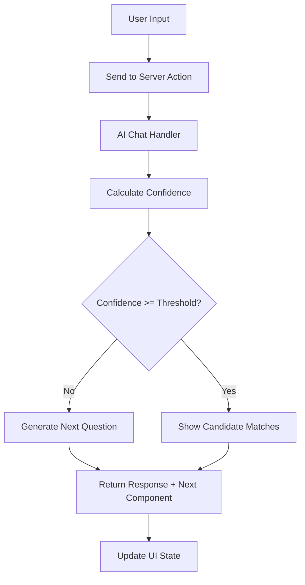

# AI Chat and Dynamic Questions

## Overview
The AI system handles conversational input, generates dynamic questions, and updates UI components based on user responses. It uses LangChain for orchestration with configurable AI models specified via environment variables. Every user response triggers confidence calculation - once confidence reaches the threshold (AI_CONFIDENCE_THRESHOLD), candidate matches are displayed on the right side.

## Dependencies
```bash
# Install LangChain packages
bun add langchain @langchain/openai @langchain/community
bun add -d @types/node

# Install additional AI packages
bun add zod openai
```

## Implementation Steps

### 1. Create AI Configuration
**File: `voting-advisor/src/lib/server/ai/config.ts`**
```typescript
// Server-only AI configuration
export const AI_CONFIG = {
  models: {
    small: process.env.AI_MODEL_SMALL || 'gpt-3.5-turbo',
    large: process.env.AI_MODEL_LARGE || 'gpt-4',
    reasoning: process.env.AI_MODEL_REASONING || 'gpt-4-turbo'
  },
  thresholds: {
    confidence: parseInt(process.env.AI_CONFIDENCE_THRESHOLD || '60'),
    minInteractions: parseInt(process.env.MIN_INTERACTIONS_BEFORE_RESULTS || '3')
  },
  limits: {
    maxTokens: parseInt(process.env.AI_MAX_TOKENS || '2000'),
    temperature: parseFloat(process.env.AI_TEMPERATURE || '0.7')
  }
};

export function getAIConfig() {
  return AI_CONFIG;
}
```

### 2. Create Confidence Calculator
**File: `voting-advisor/src/lib/server/ai/confidence-calculator.ts`**
```typescript
// Server-only confidence calculation
import type { UserResponse, ConversationMessage } from '@/types';

export interface ConfidenceResult {
  score: number; // 0-100
  factors: {
    responseQuality: number;
    topicCoverage: number;
    consistency: number;
    interactionCount: number;
  };
  reasoning: string;
}

export class ConfidenceCalculator {
  private static readonly TOPICS = [
    'economy', 'healthcare', 'education', 'environment',
    'foreign policy', 'social issues', 'taxes', 'government'
  ];

  static calculate(
    responses: UserResponse[],
    conversationHistory: ConversationMessage[]
  ): ConfidenceResult {
    const factors = {
      responseQuality: this.calculateResponseQuality(responses),
      topicCoverage: this.calculateTopicCoverage(responses),
      consistency: this.calculateConsistency(responses),
      interactionCount: this.calculateInteractionCount(responses)
    };

    // Weighted average calculation
    const score = Math.round(
      factors.responseQuality * 0.3 +
      factors.topicCoverage * 0.3 +
      factors.consistency * 0.2 +
      factors.interactionCount * 0.2
    );

    const reasoning = this.generateReasoning(factors, score);

    return {
      score: Math.min(100, Math.max(0, score)),
      factors,
      reasoning
    };
  }

  private static calculateResponseQuality(responses: UserResponse[]): number {
    if (responses.length === 0) return 0;

    let totalQuality = 0;

    for (const response of responses) {
      let quality = 50; // Base quality

      // Check response length (longer = more detailed)
      if (response.value && typeof response.value === 'string') {
        const length = response.value.length;
        if (length > 100) quality += 20;
        else if (length > 50) quality += 10;
        else if (length < 10) quality -= 10;
      }

      // Check if user provided confidence rating
      if (response.confidence !== undefined) {
        quality += 10;
      }

      totalQuality += quality;
    }

    return Math.min(100, totalQuality / responses.length);
  }

  private static calculateTopicCoverage(responses: UserResponse[]): number {
    if (responses.length === 0) return 0;

    const coveredTopics = new Set<string>();

    for (const response of responses) {
      const responseText = this.extractTextFromResponse(response);

      for (const topic of this.TOPICS) {
        if (responseText.toLowerCase().includes(topic)) {
          coveredTopics.add(topic);
        }
      }
    }

    const coverageRatio = coveredTopics.size / this.TOPICS.length;
    return Math.round(coverageRatio * 100);
  }

  private static calculateConsistency(responses: UserResponse[]): number {
    if (responses.length < 2) return 50; // Neutral for few responses

    // Simple consistency check - in production, use more sophisticated analysis
    let consistentCount = 0;
    const totalPairs = responses.length - 1;

    for (let i = 0; i < totalPairs; i++) {
      const current = responses[i];
      const next = responses[i + 1];

      // Check if responses are on related topics
      const currentText = this.extractTextFromResponse(current);
      const nextText = this.extractTextFromResponse(next);

      const currentTopics = this.extractTopics(currentText);
      const nextTopics = this.extractTopics(nextText);

      const hasOverlap = currentTopics.some(topic =>
        nextTopics.includes(topic)
      );

      if (hasOverlap) consistentCount++;
    }

    return Math.round((consistentCount / totalPairs) * 100);
  }

  private static calculateInteractionCount(responses: UserResponse[]): number {
    const count = responses.length;
    const minInteractions = 3; // Minimum for meaningful assessment

    if (count >= minInteractions) return 100;
    return Math.round((count / minInteractions) * 100);
  }

  private static extractTextFromResponse(response: UserResponse): string {
    if (typeof response.value === 'string') return response.value;
    if (Array.isArray(response.value)) return response.value.join(' ');
    if (typeof response.value === 'object') return JSON.stringify(response.value);
    return String(response.value || '');
  }

  private static extractTopics(text: string): string[] {
    const topics: string[] = [];
    const lowerText = text.toLowerCase();

    for (const topic of this.TOPICS) {
      if (lowerText.includes(topic)) {
        topics.push(topic);
      }
    }

    return topics;
  }

  private static generateReasoning(factors: ConfidenceResult['factors'], score: number): string {
    const reasons: string[] = [];

    if (factors.responseQuality > 70) {
      reasons.push('User provides detailed, thoughtful responses');
    } else if (factors.responseQuality < 40) {
      reasons.push('Responses are brief or unclear');
    }

    if (factors.topicCoverage > 70) {
      reasons.push('Good coverage of different policy areas');
    } else if (factors.topicCoverage < 40) {
      reasons.push('Limited exploration of policy topics');
    }

    if (factors.consistency > 70) {
      reasons.push('Consistent focus on related topics');
    } else if (factors.consistency < 40) {
      reasons.push('Topics seem disconnected');
    }

    if (factors.interactionCount > 70) {
      reasons.push('Sufficient interaction history');
    } else {
      reasons.push('Need more responses for accurate assessment');
    }

    return reasons.join('. ') + '.';
  }
}
```

### 3. Create AI Chat Handler
**File: `voting-advisor/src/lib/server/ai/chat-handler.ts`**
```typescript
// Server-only AI chat processing
import { ChatOpenAI } from '@langchain/openai';
import { HumanMessage, AIMessage, SystemMessage } from '@langchain/core/messages';
import { getAIConfig } from './config';
import { ConfidenceCalculator } from './confidence-calculator';
import type { ConversationMessage, UserResponse, ComponentData } from '@/types';

export interface ChatResponse {
  message: string;
  confidence: number;
  shouldShowCandidates: boolean;
  nextComponent?: ComponentData;
  candidateMatches?: any[];
}

export class AIChatHandler {
  private chatModel: ChatOpenAI;

  constructor() {
    const config = getAIConfig();
    this.chatModel = new ChatOpenAI({
      modelName: config.models.large,
      temperature: config.limits.temperature,
      maxTokens: config.limits.maxTokens,
      openAIApiKey: process.env.OPENAI_API_KEY!
    });
  }

  async processMessage(
    userMessage: string,
    conversationHistory: ConversationMessage[],
    userResponses: UserResponse[]
  ): Promise<ChatResponse> {
    try {
      // Calculate current confidence
      const confidenceResult = ConfidenceCalculator.calculate(
        userResponses,
        conversationHistory
      );

      // Prepare conversation context
      const messages = this.buildConversationContext(
        userMessage,
        conversationHistory,
        confidenceResult
      );

      // Get AI response
      const aiResponse = await this.chatModel.call(messages);
      const responseText = aiResponse.content;

      // Determine next component based on context
      const nextComponent = await this.determineNextComponent(
        userMessage,
        responseText,
        confidenceResult,
        conversationHistory
      );

      // Check if we should show candidates
      const config = getAIConfig();
      const shouldShowCandidates =
        confidenceResult.score >= config.thresholds.confidence &&
        userResponses.length >= config.thresholds.minInteractions;

      return {
        message: responseText,
        confidence: confidenceResult.score,
        shouldShowCandidates,
        nextComponent,
        candidateMatches: shouldShowCandidates ? await this.generateCandidateMatches(userResponses) : undefined
      };

    } catch (error) {
      console.error('AI chat processing error:', error);
      throw new Error('Failed to process chat message');
    }
  }

  private buildConversationContext(
    userMessage: string,
    history: ConversationMessage[],
    confidence: any
  ): (HumanMessage | AIMessage | SystemMessage)[] {
    const messages: (HumanMessage | AIMessage | SystemMessage)[] = [];

    // System prompt
    messages.push(new SystemMessage(
      `You are an AI political advisor helping users discover their voting preferences.
      Current confidence level: ${confidence.score}/100
      Reasoning: ${confidence.reasoning}

      Be conversational, neutral, and helpful. Ask follow-up questions to understand their views better.
      Focus on policy topics and candidate positions.`
    ));

    // Add recent conversation history (last 10 messages)
    const recentHistory = history.slice(-10);
    for (const msg of recentHistory) {
      if (msg.role === 'user') {
        messages.push(new HumanMessage(msg.content));
      } else {
        messages.push(new AIMessage(msg.content));
      }
    }

    // Add current user message
    messages.push(new HumanMessage(userMessage));

    return messages;
  }

  private async determineNextComponent(
    userMessage: string,
    aiResponse: string,
    confidence: any,
    history: ConversationMessage[]
  ): Promise<ComponentData | undefined> {
    // Simple logic to determine next component - enhance with AI in production
    const config = getAIConfig();

    // If confidence is low, continue with chat
    if (confidence.score < config.thresholds.confidence) {
      return {
        type: 'chat',
        data: {
          messages: [],
          placeholder: 'Tell me more about your views...'
        }
      };
    }

    // If we have enough responses, suggest a different interaction type
    const lastComponents = history.slice(-3).map(h => h.componentData?.type).filter(Boolean);

    if (!lastComponents.includes('multiselect')) {
      return {
        type: 'multiselect',
        data: {
          question: 'Which of these issues matter most to you?',
          options: [
            { id: 'economy', label: 'Economy & Jobs', description: 'Economic policy and employment' },
            { id: 'healthcare', label: 'Healthcare', description: 'Medical care and health policy' },
            { id: 'education', label: 'Education', description: 'Schools and learning opportunities' },
            { id: 'environment', label: 'Environment', description: 'Climate change and conservation' }
          ],
          maxSelections: 3
        }
      };
    }

    // Default to chat
    return {
      type: 'chat',
      data: {
        messages: [],
        placeholder: 'What else would you like to know?'
      }
    };
  }

  private async generateCandidateMatches(userResponses: UserResponse[]): Promise<any[]> {
    // Simplified candidate matching - in production, use more sophisticated algorithm
    // This would integrate with the RAG system and database

    // For now, return mock matches
    return [
      {
        id: 'candidate_1',
        name: 'Jane Smith',
        party: 'Democratic',
        score: 85,
        reasoning: 'Strong alignment with progressive policies',
        topPolicies: ['Healthcare reform', 'Climate action', 'Economic equality']
      },
      {
        id: 'candidate_2',
        name: 'John Doe',
        party: 'Republican',
        score: 72,
        reasoning: 'Conservative positions on key issues',
        topPolicies: ['Tax reduction', 'Border security', 'Second Amendment']
      }
    ];
  }
}
```

### 4. Create Server Actions for Chat
**File: `voting-advisor/src/lib/actions/chat.ts`**
```typescript
'use server';

import { AIChatHandler, type ChatResponse } from '@/lib/server/ai/chat-handler';
import type { ConversationMessage, UserResponse } from '@/types';

let chatHandler: AIChatHandler | null = null;

function getChatHandler() {
  if (!chatHandler) {
    chatHandler = new AIChatHandler();
  }
  return chatHandler;
}

export async function processChatMessage(
  message: string,
  conversationHistory: ConversationMessage[],
  userResponses: UserResponse[]
): Promise<ChatResponse> {
  try {
    const handler = getChatHandler();
    const response = await handler.processMessage(message, conversationHistory, userResponses);

    return response;
  } catch (error) {
    console.error('Chat processing failed:', error);
    return {
      message: 'I apologize, but I encountered an error processing your message. Please try again.',
      confidence: 0,
      shouldShowCandidates: false
    };
  }
}

export async function generateNextQuestion(
  conversationHistory: ConversationMessage[],
  userResponses: UserResponse[],
  questionType: string = 'chat'
): Promise<{ question: string; type: string; context?: string }> {
  try {
    const handler = getChatHandler();

    // Generate a contextual question
    const prompt = `Based on this conversation history, generate a ${questionType} question to better understand the user's political preferences.

Conversation:
${conversationHistory.map(h => `${h.role}: ${h.content}`).join('\n')}

User responses so far: ${userResponses.length}

Generate a question that explores new territory or digs deeper into their views.`;

    // This is a simplified implementation - in production, use the AI handler
    const questions = {
      chat: 'What specific policy areas are most important to you?',
      yesno: 'Do you support increasing the minimum wage to $15 per hour?',
      multiselect: 'Which of these social issues matter most to you?'
    };

    return {
      question: questions[questionType as keyof typeof questions] || questions.chat,
      type: questionType,
      context: 'Exploring user preferences'
    };

  } catch (error) {
    console.error('Question generation failed:', error);
    return {
      question: 'What are your thoughts on current political issues?',
      type: 'chat',
      context: 'Fallback question'
    };
  }
}
```

### 5. Create Client Hook for Chat
**File: `voting-advisor/src/lib/client/hooks/useChat.ts`**
```typescript
'use client';

import { useState, useCallback } from 'react';
import type { ConversationMessage, UserResponse, ChatResponse } from '@/types';

export function useChat() {
  const [messages, setMessages] = useState<ConversationMessage[]>([]);
  const [isLoading, setIsLoading] = useState(false);
  const [error, setError] = useState<string | null>(null);
  const [confidence, setConfidence] = useState(0);
  const [shouldShowCandidates, setShouldShowCandidates] = useState(false);

  const sendMessage = useCallback(async (
    message: string,
    userResponses: UserResponse[]
  ) => {
    setIsLoading(true);
    setError(null);

    try {
      // Add user message to history
      const userMessage: ConversationMessage = {
        id: `msg_${Date.now()}`,
        role: 'user',
        content: message,
        timestamp: new Date()
      };

      const updatedHistory = [...messages, userMessage];
      setMessages(updatedHistory);

      // Process with AI
      const response = await fetch('/api/chat/process', {
        method: 'POST',
        headers: { 'Content-Type': 'application/json' },
        body: JSON.stringify({
          message,
          conversationHistory: updatedHistory,
          userResponses
        })
      });

      const result: ChatResponse = await response.json();

      if (!result) {
        throw new Error('No response from server');
      }

      // Add AI response to history
      const aiMessage: ConversationMessage = {
        id: `msg_${Date.now() + 1}`,
        role: 'assistant',
        content: result.message,
        timestamp: new Date(),
        componentData: result.nextComponent
      };

      setMessages(prev => [...prev, aiMessage]);
      setConfidence(result.confidence);
      setShouldShowCandidates(result.shouldShowCandidates);

      return result;

    } catch (err) {
      const errorMessage = err instanceof Error ? err.message : 'Unknown error';
      setError(errorMessage);
      console.error('Chat error:', err);
      throw err;
    } finally {
      setIsLoading(false);
    }
  }, [messages]);

  const clearChat = useCallback(() => {
    setMessages([]);
    setConfidence(0);
    setShouldShowCandidates(false);
    setError(null);
  }, []);

  return {
    messages,
    isLoading,
    error,
    confidence,
    shouldShowCandidates,
    sendMessage,
    clearChat
  };
}
```

### 6. Create API Route for Chat
**File: `voting-advisor/src/app/api/chat/process/route.ts`**
```typescript
import { NextRequest, NextResponse } from 'next/server';
import { processChatMessage } from '@/lib/actions/chat';

export async function POST(request: NextRequest) {
  try {
    const { message, conversationHistory, userResponses } = await request.json();

    if (!message || typeof message !== 'string') {
      return NextResponse.json(
        { error: 'Message is required' },
        { status: 400 }
      );
    }

    const result = await processChatMessage(message, conversationHistory || [], userResponses || []);

    return NextResponse.json(result);
  } catch (error) {
    console.error('Chat API error:', error);
    return NextResponse.json(
      { error: 'Internal server error', message: 'Failed to process chat message' },
      { status: 500 }
    );
  }
}
```

## Conversation Flow


## Integration Points
- Connects to RAG system for context-aware responses via Server Actions
- Updates candidate matching in real-time based on confidence scoring
- Stores conversation history in local browser storage
- Handles error cases with fallback components
- Triggers UI component switching based on AI decisions

## Features
- Natural language processing with LangChain
- Context awareness from conversation history
- Dynamic component switching based on confidence
- Auto-persistence of AI responses to prevent data loss
- Confidence-based progressive disclosure
- Fallback for offline/limited data scenarios
- Server-client separation compliance

## Testing the AI Chat System

### 1. Test Confidence Calculation
```typescript
import { ConfidenceCalculator } from '@/lib/server/ai/confidence-calculator';

const responses: UserResponse[] = [
  { id: '1', questionId: 'q1', componentType: 'chat', value: 'I care about healthcare', timestamp: new Date() }
];

const result = ConfidenceCalculator.calculate(responses, []);
console.log('Confidence:', result.score);
console.log('Reasoning:', result.reasoning);
```

### 2. Test Chat Processing
```typescript
const response = await processChatMessage(
  'What do you think about climate change?',
  [],
  []
);

console.log('AI Response:', response.message);
console.log('Confidence:', response.confidence);
console.log('Show Candidates:', response.shouldShowCandidates);
```

## Commit Instructions
After implementing the AI chat system:
```bash
jj describe -m "Implement AI chat system with confidence scoring and Server Actions"
jj new
```