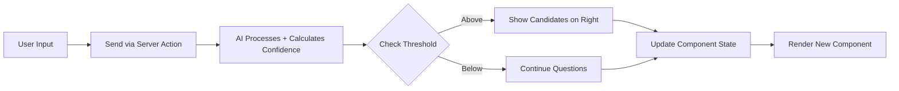

# UI Left Side: Dynamic Input Components

## Overview
The left side of the interface hosts dynamic input mechanisms controlled by the AI. Components are pre-programmed skeletons filled with AI-generated data, allowing seamless transitions based on user responses. Built with Next.js, shadcn/ui, and follows mobile-first responsive design.

## Dependencies
```bash
# Install UI components
bun add @radix-ui/react-dialog @radix-ui/react-slider @radix-ui/react-checkbox
bun add class-variance-authority clsx tailwind-merge
bun add lucide-react

# Install form handling
bun add react-hook-form @hookform/resolvers zod

# Install swipe functionality (optional)
bun add react-tinder-card
bun add -d @types/react-tinder-card
```

## Implementation Steps

### 1. Set up shadcn/ui Components
First, initialize shadcn/ui in the Next.js project:

```bash
# Initialize shadcn/ui
npx shadcn-ui@latest init

# Add required components
npx shadcn-ui@latest add button
npx shadcn-ui@latest add card
npx shadcn-ui@latest add input
npx shadcn-ui@latest add textarea
npx shadcn-ui@latest add checkbox
npx shadcn-ui@latest add slider
npx shadcn-ui@latest add progress
npx shadcn-ui@latest add badge
```

### 2. Create Base Component Types
**File: `voting-advisor/src/types/components.ts`**
```typescript
import type { ComponentType, ComponentSpecificData } from './index';

export interface DynamicComponentProps {
  componentData: ComponentSpecificData;
  onResponse: (response: any) => void;
  onNext?: () => void;
  disabled?: boolean;
}

export interface ComponentRendererProps {
  type: ComponentType;
  data: ComponentSpecificData;
  onResponse: (response: any) => void;
  onNext?: () => void;
  disabled?: boolean;
}
```

### 3. Create Chat Interface Component
**File: `voting-advisor/src/components/dynamic/ChatInterface.tsx`**
```tsx
'use client';

import { useState, useRef, useEffect } from 'react';
import { Button } from '@/components/ui/button';
import { Input } from '@/components/ui/input';
import { Card, CardContent } from '@/components/ui/card';
import { Send, Bot, User } from 'lucide-react';
import type { ChatData, ConversationMessage } from '@/types';

interface ChatInterfaceProps {
  data: ChatData;
  onSendMessage: (message: string) => void;
  messages: ConversationMessage[];
  isLoading?: boolean;
  disabled?: boolean;
}

export function ChatInterface({
  data,
  onSendMessage,
  messages,
  isLoading = false,
  disabled = false
}: ChatInterfaceProps) {
  const [inputValue, setInputValue] = useState('');
  const messagesEndRef = useRef<HTMLDivElement>(null);

  const scrollToBottom = () => {
    messagesEndRef.current?.scrollIntoView({ behavior: 'smooth' });
  };

  useEffect(() => {
    scrollToBottom();
  }, [messages]);

  const handleSend = () => {
    if (inputValue.trim() && !disabled && !isLoading) {
      onSendMessage(inputValue.trim());
      setInputValue('');
    }
  };

  const handleKeyPress = (e: React.KeyboardEvent) => {
    if (e.key === 'Enter' && !e.shiftKey) {
      e.preventDefault();
      handleSend();
    }
  };

  return (
    <Card className="flex flex-col h-full max-h-[600px]">
      <CardContent className="flex-1 flex flex-col p-4">
        {/* Messages Area */}
        <div className="flex-1 overflow-y-auto space-y-4 mb-4">
          {messages.length === 0 && (
            <div className="text-center text-muted-foreground py-8">
              <Bot className="mx-auto mb-2 h-8 w-8" />
              <p>Start a conversation to discover your political preferences!</p>
            </div>
          )}

          {messages.map((message) => (
            <div
              key={message.id}
              className={`flex items-start space-x-2 ${
                message.role === 'user' ? 'justify-end' : 'justify-start'
              }`}
            >
              {message.role === 'assistant' && (
                <div className="flex-shrink-0 w-8 h-8 bg-primary rounded-full flex items-center justify-center">
                  <Bot className="h-4 w-4 text-primary-foreground" />
                </div>
              )}

              <div
                className={`max-w-[80%] rounded-lg px-3 py-2 ${
                  message.role === 'user'
                    ? 'bg-primary text-primary-foreground ml-auto'
                    : 'bg-muted'
                }`}
              >
                <p className="text-sm whitespace-pre-wrap">{message.content}</p>
                <span className="text-xs opacity-70 mt-1 block">
                  {message.timestamp.toLocaleTimeString()}
                </span>
              </div>

              {message.role === 'user' && (
                <div className="flex-shrink-0 w-8 h-8 bg-secondary rounded-full flex items-center justify-center">
                  <User className="h-4 w-4 text-secondary-foreground" />
                </div>
              )}
            </div>
          ))}

          {isLoading && (
            <div className="flex items-start space-x-2">
              <div className="flex-shrink-0 w-8 h-8 bg-primary rounded-full flex items-center justify-center">
                <Bot className="h-4 w-4 text-primary-foreground" />
              </div>
              <div className="bg-muted rounded-lg px-3 py-2">
                <div className="flex space-x-1">
                  <div className="w-2 h-2 bg-current rounded-full animate-bounce" />
                  <div className="w-2 h-2 bg-current rounded-full animate-bounce" style={{ animationDelay: '0.1s' }} />
                  <div className="w-2 h-2 bg-current rounded-full animate-bounce" style={{ animationDelay: '0.2s' }} />
                </div>
              </div>
            </div>
          )}

          <div ref={messagesEndRef} />
        </div>

        {/* Input Area */}
        <div className="flex space-x-2">
          <Input
            value={inputValue}
            onChange={(e) => setInputValue(e.target.value)}
            onKeyPress={handleKeyPress}
            placeholder={data.placeholder || 'Type your message...'}
            disabled={disabled || isLoading}
            className="flex-1"
          />
          <Button
            onClick={handleSend}
            disabled={!inputValue.trim() || disabled || isLoading}
            size="icon"
          >
            <Send className="h-4 w-4" />
          </Button>
        </div>
      </CardContent>
    </Card>
  );
}
```

### 4. Create Yes/No Question Component
**File: `voting-advisor/src/components/dynamic/YesNoQuestion.tsx`**
```tsx
'use client';

import { Button } from '@/components/ui/button';
import { Card, CardContent, CardHeader, CardTitle } from '@/components/ui/card';
import { ThumbsUp, ThumbsDown, SkipForward } from 'lucide-react';
import type { YesNoData } from '@/types';

interface YesNoQuestionProps {
  data: YesNoData;
  onResponse: (response: 'agree' | 'disagree' | 'skip') => void;
  disabled?: boolean;
}

export function YesNoQuestion({ data, onResponse, disabled = false }: YesNoQuestionProps) {
  return (
    <Card className="w-full max-w-md mx-auto">
      <CardHeader>
        <CardTitle className="text-lg">Statement</CardTitle>
      </CardHeader>
      <CardContent className="space-y-6">
        <div className="text-center">
          <p className="text-base leading-relaxed">{data.statement}</p>
          {data.context && (
            <p className="text-sm text-muted-foreground mt-2">{data.context}</p>
          )}
        </div>

        <div className="flex flex-col sm:flex-row gap-3">
          <Button
            onClick={() => onResponse('agree')}
            disabled={disabled}
            className="flex-1 h-12"
            variant="default"
          >
            <ThumbsUp className="mr-2 h-4 w-4" />
            Agree
          </Button>

          <Button
            onClick={() => onResponse('disagree')}
            disabled={disabled}
            className="flex-1 h-12"
            variant="outline"
          >
            <ThumbsDown className="mr-2 h-4 w-4" />
            Disagree
          </Button>
        </div>

        <Button
          onClick={() => onResponse('skip')}
          disabled={disabled}
          variant="ghost"
          className="w-full"
        >
          <SkipForward className="mr-2 h-4 w-4" />
          Skip for now
        </Button>
      </CardContent>
    </Card>
  );
}
```

### 5. Create Multi-Select Component
**File: `voting-advisor/src/components/dynamic/MultiSelectChecklist.tsx`**
```tsx
'use client';

import { useState } from 'react';
import { Checkbox } from '@/components/ui/checkbox';
import { Card, CardContent, CardHeader, CardTitle } from '@/components/ui/card';
import { Button } from '@/components/ui/button';
import { Badge } from '@/components/ui/badge';
import type { MultiSelectData, SelectOption } from '@/types';

interface MultiSelectChecklistProps {
  data: MultiSelectData;
  onResponse: (selectedIds: string[]) => void;
  disabled?: boolean;
}

export function MultiSelectChecklist({ data, onResponse, disabled = false }: MultiSelectChecklistProps) {
  const [selectedIds, setSelectedIds] = useState<string[]>([]);

  const handleOptionToggle = (optionId: string, checked: boolean) => {
    let newSelected: string[];

    if (checked) {
      if (data.maxSelections && selectedIds.length >= data.maxSelections) {
        return; // Don't allow more selections than max
      }
      newSelected = [...selectedIds, optionId];
    } else {
      newSelected = selectedIds.filter(id => id !== optionId);
    }

    setSelectedIds(newSelected);
  };

  const handleSubmit = () => {
    if (selectedIds.length > 0) {
      onResponse(selectedIds);
    }
  };

  const selectedCount = selectedIds.length;
  const maxSelections = data.maxSelections;

  return (
    <Card className="w-full max-w-lg mx-auto">
      <CardHeader>
        <CardTitle className="text-lg">{data.question}</CardTitle>
        {maxSelections && (
          <div className="flex items-center space-x-2">
            <Badge variant="secondary">
              {selectedCount}/{maxSelections} selected
            </Badge>
          </div>
        )}
      </CardHeader>
      <CardContent className="space-y-4">
        <div className="space-y-3">
          {data.options.map((option) => (
            <div key={option.id} className="flex items-start space-x-3">
              <Checkbox
                id={option.id}
                checked={selectedIds.includes(option.id)}
                onCheckedChange={(checked) =>
                  handleOptionToggle(option.id, checked as boolean)
                }
                disabled={
                  disabled ||
                  (maxSelections &&
                   !selectedIds.includes(option.id) &&
                   selectedIds.length >= maxSelections)
                }
                className="mt-1"
              />
              <div className="flex-1">
                <label
                  htmlFor={option.id}
                  className="text-sm font-medium cursor-pointer"
                >
                  {option.label}
                </label>
                {option.description && (
                  <p className="text-sm text-muted-foreground mt-1">
                    {option.description}
                  </p>
                )}
              </div>
            </div>
          ))}
        </div>

        <Button
          onClick={handleSubmit}
          disabled={disabled || selectedIds.length === 0}
          className="w-full"
        >
          Continue ({selectedIds.length} selected)
        </Button>
      </CardContent>
    </Card>
  );
}
```

### 6. Create Free Text Input Component
**File: `voting-advisor/src/components/dynamic/FreeTextInput.tsx`**
```tsx
'use client';

import { useState } from 'react';
import { Button } from '@/components/ui/button';
import { Textarea } from '@/components/ui/textarea';
import { Card, CardContent, CardHeader, CardTitle } from '@/components/ui/card';
import { Send } from 'lucide-react';
import type { FreeTextData } from '@/types';

interface FreeTextInputProps {
  data: FreeTextData;
  onResponse: (text: string) => void;
  disabled?: boolean;
}

export function FreeTextInput({ data, onResponse, disabled = false }: FreeTextInputProps) {
  const [text, setText] = useState('');
  const characterCount = text.length;
  const maxLength = data.maxLength || 1000;

  const handleSubmit = () => {
    if (text.trim()) {
      onResponse(text.trim());
      setText('');
    }
  };

  const handleKeyPress = (e: React.KeyboardEvent) => {
    if (e.key === 'Enter' && (e.ctrlKey || e.metaKey)) {
      e.preventDefault();
      handleSubmit();
    }
  };

  return (
    <Card className="w-full max-w-lg mx-auto">
      <CardHeader>
        <CardTitle className="text-lg">{data.prompt}</CardTitle>
      </CardHeader>
      <CardContent className="space-y-4">
        <div className="space-y-2">
          <Textarea
            value={text}
            onChange={(e) => setText(e.target.value)}
            onKeyDown={handleKeyPress}
            placeholder={data.placeholder}
            disabled={disabled}
            maxLength={maxLength}
            rows={6}
            className="resize-none"
          />
          <div className="flex justify-between text-sm text-muted-foreground">
            <span>Share your detailed thoughts</span>
            <span>{characterCount}/{maxLength}</span>
          </div>
        </div>

        <Button
          onClick={handleSubmit}
          disabled={disabled || !text.trim()}
          className="w-full"
        >
          <Send className="mr-2 h-4 w-4" />
          Submit Response
        </Button>
      </CardContent>
    </Card>
  );
}
```

### 7. Create Slider Component
**File: `voting-advisor/src/components/dynamic/QuantitativeSlider.tsx`**
```tsx
'use client';

import { useState } from 'react';
import { Slider } from '@/components/ui/slider';
import { Card, CardContent, CardHeader, CardTitle } from '@/components/ui/card';
import { Button } from '@/components/ui/button';
import type { SliderData } from '@/types';

interface QuantitativeSliderProps {
  data: SliderData;
  onResponse: (value: number) => void;
  disabled?: boolean;
}

export function QuantitativeSlider({ data, onResponse, disabled = false }: QuantitativeSliderProps) {
  const [value, setValue] = useState<number>((data.min + data.max) / 2);

  const handleSubmit = () => {
    onResponse(value);
  };

  const percentage = Math.round(((value - data.min) / (data.max - data.min)) * 100);

  return (
    <Card className="w-full max-w-lg mx-auto">
      <CardHeader>
        <CardTitle className="text-lg">{data.label}</CardTitle>
        {data.description && (
          <p className="text-sm text-muted-foreground">{data.description}</p>
        )}
      </CardHeader>
      <CardContent className="space-y-6">
        <div className="space-y-4">
          <div className="text-center">
            <div className="text-3xl font-bold text-primary">{value}</div>
            {data.unit && <div className="text-sm text-muted-foreground">{data.unit}</div>}
            <div className="text-sm text-muted-foreground mt-1">
              {percentage}% of maximum
            </div>
          </div>

          <Slider
            value={[value]}
            onValueChange={(values) => setValue(values[0])}
            min={data.min}
            max={data.max}
            step={data.step || 1}
            disabled={disabled}
            className="w-full"
          />

          <div className="flex justify-between text-sm text-muted-foreground">
            <span>{data.min}{data.unit && ` ${data.unit}`}</span>
            <span>{data.max}{data.unit && ` ${data.unit}`}</span>
          </div>
        </div>

        <Button
          onClick={handleSubmit}
          disabled={disabled}
          className="w-full"
        >
          Confirm Selection
        </Button>
      </CardContent>
    </Card>
  );
}
```

### 8. Create Component Renderer
**File: `voting-advisor/src/components/dynamic/ComponentRenderer.tsx`**
```tsx
'use client';

import type { ComponentRendererProps } from '@/types/components';
import { ChatInterface } from './ChatInterface';
import { YesNoQuestion } from './YesNoQuestion';
import { MultiSelectChecklist } from './MultiSelectChecklist';
import { FreeTextInput } from './FreeTextInput';
import { QuantitativeSlider } from './QuantitativeSlider';

export function ComponentRenderer({
  type,
  data,
  onResponse,
  onNext,
  disabled = false
}: ComponentRendererProps) {
  switch (type) {
    case 'chat':
      return (
        <ChatInterface
          data={data as any}
          onSendMessage={onResponse}
          messages={[]} // This would come from props
          disabled={disabled}
        />
      );

    case 'yesno':
      return (
        <YesNoQuestion
          data={data as any}
          onResponse={onResponse}
          disabled={disabled}
        />
      );

    case 'multiselect':
      return (
        <MultiSelectChecklist
          data={data as any}
          onResponse={onResponse}
          disabled={disabled}
        />
      );

    case 'freetext':
      return (
        <FreeTextInput
          data={data as any}
          onResponse={onResponse}
          disabled={disabled}
        />
      );

    case 'slider':
      return (
        <QuantitativeSlider
          data={data as any}
          onResponse={onResponse}
          disabled={disabled}
        />
      );

    default:
      return (
        <div className="text-center p-8">
          <p className="text-muted-foreground">
            Component type "{type}" not implemented yet.
          </p>
        </div>
      );
  }
}
```

### 9. Create Progress and Navigation
**File: `voting-advisor/src/components/ui/ProgressBar.tsx`**
```tsx
'use client';

import { Progress } from '@/components/ui/progress';
import { Button } from '@/components/ui/button';
import { RotateCcw, Undo2 } from 'lucide-react';

interface ProgressBarProps {
  progress: number; // 0-100
  onReset?: () => void;
  onUndo?: () => void;
  showUndo?: boolean;
}

export function ProgressBar({ progress, onReset, onUndo, showUndo = false }: ProgressBarProps) {
  return (
    <div className="w-full space-y-2">
      <div className="flex justify-between items-center">
        <span className="text-sm font-medium">Progress</span>
        <span className="text-sm text-muted-foreground">{Math.round(progress)}%</span>
      </div>

      <Progress value={progress} className="w-full" />

      <div className="flex justify-end space-x-2">
        {showUndo && onUndo && (
          <Button variant="outline" size="sm" onClick={onUndo}>
            <Undo2 className="mr-2 h-4 w-4" />
            Undo
          </Button>
        )}

        {onReset && (
          <Button variant="outline" size="sm" onClick={onReset}>
            <RotateCcw className="mr-2 h-4 w-4" />
            Reset
          </Button>
        )}
      </div>
    </div>
  );
}
```

## Dynamic Updates
Components are updated based on AI responses via Server Actions. Every user response triggers confidence calculation and potential candidate display.



## Integration Points
- Connects to AI backend via Server Actions
- Updates parent component state for right-side display
- Stores user responses in local browser storage
- Handles mobile responsive behavior

## Navigation Features
- Progress bar: Shows completion percentage based on confidence score
- Undo button: Revert last input (stored in localStorage)
- Reset option: Clear all inputs and start over

## Mobile Behavior
On mobile devices, the left side should collapse when the right side (candidate matches) becomes active, allowing users to focus on one section at a time. This creates an effective single-panel experience that switches between question input and candidate results.

## Testing the Components

### 1. Test Individual Components
```tsx
// Test ChatInterface
<ChatInterface
  data={{ messages: [], placeholder: 'Test message...' }}
  onSendMessage={(msg) => console.log('Sent:', msg)}
  messages={[]}
/>

// Test YesNoQuestion
<YesNoQuestion
  data={{ statement: 'Do you support this policy?' }}
  onResponse={(response) => console.log('Response:', response)}
/>
```

### 2. Test Component Renderer
```tsx
<ComponentRenderer
  type="multiselect"
  data={{
    question: 'Select your priorities',
    options: [
      { id: 'health', label: 'Healthcare' },
      { id: 'economy', label: 'Economy' }
    ]
  }}
  onResponse={(selected) => console.log('Selected:', selected)}
/>
```

## Commit Instructions
After implementing the UI left side components:
```bash
jj describe -m "Implement dynamic UI components for left side with mobile responsiveness"
jj new
```