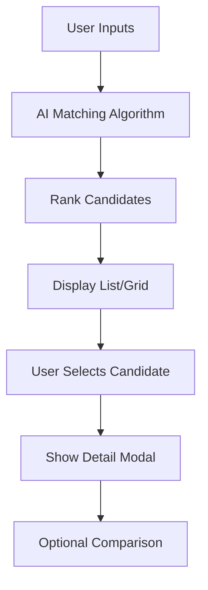

# UI Right Side: Candidate Matching Display

## Overview
The right side displays a compacted, scrollable list or grid of matching candidates/parties, ranked by relevance after reaching the AI confidence threshold (AI_CONFIDENCE_THRESHOLD). When confidence is low, candidates are shown with visual indicators (e.g., gray/transparency). On mobile, this side expands while the left side collapses.

## Dependencies
```bash
# Install additional UI components
bun add @radix-ui/react-dialog @radix-ui/react-tabs
bun add lucide-react

# Install form handling for filters
bun add react-hook-form @hookform/resolvers zod
```

## Implementation Steps

### 1. Create Candidate Card Component
**File: `voting-advisor/src/components/candidates/CandidateCard.tsx`**
```tsx
'use client';

import { Card, CardContent, CardHeader } from '@/components/ui/card';
import { Badge } from '@/components/ui/badge';
import { Progress } from '@/components/ui/progress';
import { Button } from '@/components/ui/button';
import { ExternalLink, Info, Star } from 'lucide-react';
import type { CandidateMatch } from '@/types';

interface CandidateCardProps {
  candidate: CandidateMatch;
  onSelect: (candidate: CandidateMatch) => void;
  confidence: number;
  isLowConfidence?: boolean;
}

export function CandidateCard({
  candidate,
  onSelect,
  confidence,
  isLowConfidence = false
}: CandidateCardProps) {
  const opacityClass = isLowConfidence ? 'opacity-60' : 'opacity-100';

  return (
    <Card
      className={`cursor-pointer transition-all duration-200 hover:shadow-lg ${opacityClass} ${
        isLowConfidence ? 'border-dashed' : ''
      }`}
      onClick={() => onSelect(candidate)}
    >
      <CardHeader className="pb-3">
        <div className="flex items-start justify-between">
          <div className="flex-1">
            <h3 className="font-semibold text-lg leading-tight">{candidate.candidate.name}</h3>
            <Badge variant="secondary" className="mt-1">
              {candidate.candidate.party}
            </Badge>
          </div>
          <Button variant="ghost" size="sm" className="p-1">
            <Info className="h-4 w-4" />
          </Button>
        </div>

        <div className="space-y-2">
          <div className="flex items-center justify-between">
            <span className="text-sm font-medium">Match Score</span>
            <span className="text-sm font-bold text-primary">{candidate.score}%</span>
          </div>
          <Progress value={candidate.score} className="h-2" />
        </div>
      </CardHeader>

      <CardContent className="pt-0">
        <div className="space-y-3">
          <div>
            <h4 className="text-sm font-medium mb-2">Top Matching Policies</h4>
            <ul className="space-y-1">
              {candidate.topMatchingPolicies.slice(0, 3).map((policy, index) => (
                <li key={index} className="text-sm text-muted-foreground flex items-center">
                  <Star className="h-3 w-3 mr-2 text-yellow-500 flex-shrink-0" />
                  {policy}
                </li>
              ))}
            </ul>
          </div>

          {candidate.sources && candidate.sources.length > 0 && (
            <div className="flex items-center text-xs text-muted-foreground">
              <ExternalLink className="h-3 w-3 mr-1" />
              {candidate.sources.length} source{candidate.sources.length !== 1 ? 's' : ''}
            </div>
          )}

          {isLowConfidence && (
            <div className="text-xs text-muted-foreground bg-muted p-2 rounded">
              Match confidence is building... More responses needed for accurate results.
            </div>
          )}
        </div>
      </CardContent>
    </Card>
  );
}
```

### 2. Create Candidate List Component
**File: `voting-advisor/src/components/candidates/CandidateList.tsx`**
```tsx
'use client';

import { useState, useMemo } from 'react';
import { Input } from '@/components/ui/input';
import { Button } from '@/components/ui/button';
import { Badge } from '@/components/ui/badge';
import { Select, SelectContent, SelectItem, SelectTrigger, SelectValue } from '@/components/ui/select';
import { Search, Filter, SortAsc, SortDesc } from 'lucide-react';
import { CandidateCard } from './CandidateCard';
import type { CandidateMatch } from '@/types';

interface CandidateListProps {
  candidates: CandidateMatch[];
  confidence: number;
  onSelectCandidate: (candidate: CandidateMatch) => void;
  isLoading?: boolean;
}

type SortOption = 'score' | 'name' | 'party';
type FilterOption = 'all' | 'high' | 'medium' | 'low';

export function CandidateList({
  candidates,
  confidence,
  onSelectCandidate,
  isLoading = false
}: CandidateListProps) {
  const [searchQuery, setSearchQuery] = useState('');
  const [sortBy, setSortBy] = useState<SortOption>('score');
  const [sortOrder, setSortOrder] = useState<'asc' | 'desc'>('desc');
  const [filterBy, setFilterBy] = useState<FilterOption>('all');

  const isLowConfidence = confidence < 60; // AI_CONFIDENCE_THRESHOLD

  const filteredAndSortedCandidates = useMemo(() => {
    let filtered = candidates.filter(candidate => {
      // Search filter
      const matchesSearch = !searchQuery ||
        candidate.candidate.name.toLowerCase().includes(searchQuery.toLowerCase()) ||
        candidate.candidate.party.toLowerCase().includes(searchQuery.toLowerCase()) ||
        candidate.topMatchingPolicies.some(policy =>
          policy.toLowerCase().includes(searchQuery.toLowerCase())
        );

      // Score filter
      const matchesFilter = filterBy === 'all' ||
        (filterBy === 'high' && candidate.score >= 80) ||
        (filterBy === 'medium' && candidate.score >= 60 && candidate.score < 80) ||
        (filterBy === 'low' && candidate.score < 60);

      return matchesSearch && matchesFilter;
    });

    // Sort
    filtered.sort((a, b) => {
      let aValue: string | number;
      let bValue: string | number;

      switch (sortBy) {
        case 'score':
          aValue = a.score;
          bValue = b.score;
          break;
        case 'name':
          aValue = a.candidate.name.toLowerCase();
          bValue = b.candidate.name.toLowerCase();
          break;
        case 'party':
          aValue = a.candidate.party.toLowerCase();
          bValue = b.candidate.party.toLowerCase();
          break;
        default:
          return 0;
      }

      if (typeof aValue === 'number' && typeof bValue === 'number') {
        return sortOrder === 'asc' ? aValue - bValue : bValue - aValue;
      }

      if (typeof aValue === 'string' && typeof bValue === 'string') {
        return sortOrder === 'asc'
          ? aValue.localeCompare(bValue)
          : bValue.localeCompare(aValue);
      }

      return 0;
    });

    return filtered;
  }, [candidates, searchQuery, sortBy, sortOrder, filterBy]);

  const toggleSortOrder = () => {
    setSortOrder(prev => prev === 'asc' ? 'desc' : 'asc');
  };

  if (isLoading) {
    return (
      <div className="space-y-4">
        {[...Array(3)].map((_, i) => (
          <div key={i} className="animate-pulse">
            <div className="h-32 bg-muted rounded-lg"></div>
          </div>
        ))}
      </div>
    );
  }

  return (
    <div className="space-y-4">
      {/* Search and Filters */}
      <div className="space-y-3">
        <div className="relative">
          <Search className="absolute left-3 top-1/2 transform -translate-y-1/2 h-4 w-4 text-muted-foreground" />
          <Input
            placeholder="Search candidates, parties, or policies..."
            value={searchQuery}
            onChange={(e) => setSearchQuery(e.target.value)}
            className="pl-10"
          />
        </div>

        <div className="flex flex-wrap gap-2">
          <div className="flex items-center space-x-2">
            <Filter className="h-4 w-4 text-muted-foreground" />
            <Select value={filterBy} onValueChange={(value: FilterOption) => setFilterBy(value)}>
              <SelectTrigger className="w-32">
                <SelectValue />
              </SelectTrigger>
              <SelectContent>
                <SelectItem value="all">All Matches</SelectItem>
                <SelectItem value="high">High (80%+)</SelectItem>
                <SelectItem value="medium">Medium (60-79%)</SelectItem>
                <SelectItem value="low">Low (<60%)</SelectItem>
              </SelectContent>
            </Select>
          </div>

          <div className="flex items-center space-x-2">
            <Button
              variant="outline"
              size="sm"
              onClick={toggleSortOrder}
              className="flex items-center space-x-1"
            >
              {sortOrder === 'asc' ? <SortAsc className="h-4 w-4" /> : <SortDesc className="h-4 w-4" />}
              <span>Sort</span>
            </Button>
            <Select value={sortBy} onValueChange={(value: SortOption) => setSortBy(value)}>
              <SelectTrigger className="w-32">
                <SelectValue />
              </SelectTrigger>
              <SelectContent>
                <SelectItem value="score">By Score</SelectItem>
                <SelectItem value="name">By Name</SelectItem>
                <SelectItem value="party">By Party</SelectItem>
              </SelectContent>
            </Select>
          </div>
        </div>
      </div>

      {/* Results Summary */}
      <div className="flex items-center justify-between">
        <div className="flex items-center space-x-2">
          <Badge variant="outline">
            {filteredAndSortedCandidates.length} candidate{filteredAndSortedCandidates.length !== 1 ? 's' : ''}
          </Badge>
          {isLowConfidence && (
            <Badge variant="secondary">
              Building confidence...
            </Badge>
          )}
        </div>
      </div>

      {/* Candidate Grid */}
      {filteredAndSortedCandidates.length === 0 ? (
        <div className="text-center py-12">
          <div className="text-muted-foreground">
            {searchQuery || filterBy !== 'all' ? (
              <p>No candidates match your current filters.</p>
            ) : (
              <p>No candidates available yet. Continue answering questions to see matches.</p>
            )}
          </div>
        </div>
      ) : (
        <div className="grid gap-4 md:grid-cols-2 lg:grid-cols-1">
          {filteredAndSortedCandidates.map((candidate) => (
            <CandidateCard
              key={candidate.candidate.id}
              candidate={candidate}
              onSelect={onSelectCandidate}
              confidence={confidence}
              isLowConfidence={isLowConfidence}
            />
          ))}
        </div>
      )}
    </div>
  );
}
```

### 3. Create Candidate Detail Modal
**File: `voting-advisor/src/components/candidates/CandidateModal.tsx`**
```tsx
'use client';

import { Dialog, DialogContent, DialogHeader, DialogTitle } from '@/components/ui/dialog';
import { Button } from '@/components/ui/button';
import { Badge } from '@/components/ui/badge';
import { Separator } from '@/components/ui/separator';
import { ExternalLink, CheckCircle, XCircle, Star } from 'lucide-react';
import type { CandidateMatch } from '@/types';

interface CandidateModalProps {
  candidate: CandidateMatch | null;
  isOpen: boolean;
  onClose: () => void;
  onCompare?: (candidate: CandidateMatch) => void;
}

export function CandidateModal({
  candidate,
  isOpen,
  onClose,
  onCompare
}: CandidateModalProps) {
  if (!candidate) return null;

  return (
    <Dialog open={isOpen} onOpenChange={onClose}>
      <DialogContent className="max-w-2xl max-h-[90vh] overflow-y-auto">
        <DialogHeader>
          <div className="flex items-start justify-between">
            <div>
              <DialogTitle className="text-2xl">{candidate.candidate.name}</DialogTitle>
              <Badge variant="secondary" className="mt-2">
                {candidate.candidate.party}
              </Badge>
            </div>
            <div className="text-right">
              <div className="text-3xl font-bold text-primary">{candidate.score}%</div>
              <div className="text-sm text-muted-foreground">Match Score</div>
            </div>
          </div>
        </DialogHeader>

        <div className="space-y-6">
          {/* Explanation */}
          <div>
            <h3 className="text-lg font-semibold mb-3">Why This Match?</h3>
            <p className="text-muted-foreground leading-relaxed">{candidate.reasoning}</p>
          </div>

          <Separator />

          {/* Pros and Cons */}
          <div className="grid md:grid-cols-2 gap-6">
            <div>
              <h3 className="text-lg font-semibold mb-3 flex items-center text-green-600">
                <CheckCircle className="mr-2 h-5 w-5" />
                Pros
              </h3>
              <ul className="space-y-2">
                {candidate.pros.split('\n').map((pro, index) => (
                  <li key={index} className="flex items-start">
                    <CheckCircle className="mr-2 h-4 w-4 text-green-500 mt-0.5 flex-shrink-0" />
                    <span className="text-sm">{pro}</span>
                  </li>
                ))}
              </ul>
            </div>

            <div>
              <h3 className="text-lg font-semibold mb-3 flex items-center text-red-600">
                <XCircle className="mr-2 h-5 w-5" />
                Considerations
              </h3>
              <ul className="space-y-2">
                {candidate.cons.split('\n').map((con, index) => (
                  <li key={index} className="flex items-start">
                    <XCircle className="mr-2 h-4 w-4 text-red-500 mt-0.5 flex-shrink-0" />
                    <span className="text-sm">{con}</span>
                  </li>
                ))}
              </ul>
            </div>
          </div>

          <Separator />

          {/* Top Matching Policies */}
          <div>
            <h3 className="text-lg font-semibold mb-3">Top Matching Policies</h3>
            <div className="grid gap-3">
              {candidate.topMatchingPolicies.map((policy, index) => (
                <div key={index} className="flex items-center p-3 bg-muted rounded-lg">
                  <Star className="mr-3 h-4 w-4 text-yellow-500 flex-shrink-0" />
                  <span className="text-sm">{policy}</span>
                </div>
              ))}
            </div>
          </div>

          {/* Sources */}
          {candidate.sources && candidate.sources.length > 0 && (
            <>
              <Separator />
              <div>
                <h3 className="text-lg font-semibold mb-3">Sources</h3>
                <div className="space-y-2">
                  {candidate.sources.map((source, index) => (
                    <a
                      key={index}
                      href={source.url}
                      target="_blank"
                      rel="noopener noreferrer"
                      className="flex items-center p-3 border rounded-lg hover:bg-muted transition-colors"
                    >
                      <div className="flex-1">
                        <div className="font-medium text-sm">{source.title}</div>
                        {source.date && (
                          <div className="text-xs text-muted-foreground">
                            {new Date(source.date).toLocaleDateString()}
                          </div>
                        )}
                      </div>
                      <ExternalLink className="h-4 w-4 text-muted-foreground" />
                    </a>
                  ))}
                </div>
              </div>
            </>
          )}

          {/* Actions */}
          <div className="flex justify-end space-x-3 pt-4">
            {onCompare && (
              <Button variant="outline" onClick={() => onCompare(candidate)}>
                Compare Candidates
              </Button>
            )}
            <Button onClick={onClose}>
              Close
            </Button>
          </div>
        </div>
      </DialogContent>
    </Dialog>
  );
}
```

### 4. Create Comparison View
**File: `voting-advisor/src/components/candidates/ComparisonView.tsx`**
```tsx
'use client';

import { useState } from 'react';
import { Card, CardContent, CardHeader, CardTitle } from '@/components/ui/card';
import { Badge } from '@/components/ui/badge';
import { Button } from '@/components/ui/button';
import { Tabs, TabsContent, TabsList, TabsTrigger } from '@/components/ui/tabs';
import { Progress } from '@/components/ui/progress';
import { X, Star, CheckCircle, XCircle } from 'lucide-react';
import type { CandidateMatch } from '@/types';

interface ComparisonViewProps {
  candidates: CandidateMatch[];
  onClose: () => void;
  onSelectCandidate: (candidate: CandidateMatch) => void;
}

export function ComparisonView({
  candidates,
  onClose,
  onSelectCandidate
}: ComparisonViewProps) {
  const [selectedTab, setSelectedTab] = useState('overview');

  if (candidates.length === 0) return null;

  return (
    <div className="fixed inset-0 bg-background/80 backdrop-blur-sm z-50">
      <div className="container mx-auto p-4 h-full flex items-center justify-center">
        <Card className="w-full max-w-6xl max-h-[90vh] overflow-hidden">
          <CardHeader className="flex flex-row items-center justify-between">
            <CardTitle>Candidate Comparison</CardTitle>
            <Button variant="ghost" size="sm" onClick={onClose}>
              <X className="h-4 w-4" />
            </Button>
          </CardHeader>

          <CardContent className="overflow-y-auto">
            <Tabs value={selectedTab} onValueChange={setSelectedTab}>
              <TabsList className="grid w-full grid-cols-3">
                <TabsTrigger value="overview">Overview</TabsTrigger>
                <TabsTrigger value="policies">Policies</TabsTrigger>
                <TabsTrigger value="details">Details</TabsTrigger>
              </TabsList>

              <TabsContent value="overview" className="space-y-4">
                <div className="grid gap-4 md:grid-cols-2 lg:grid-cols-3">
                  {candidates.map((candidate) => (
                    <Card key={candidate.candidate.id}>
                      <CardHeader className="pb-3">
                        <div className="flex items-center justify-between">
                          <div>
                            <CardTitle className="text-lg">{candidate.candidate.name}</CardTitle>
                            <Badge variant="secondary" className="mt-1">
                              {candidate.candidate.party}
                            </Badge>
                          </div>
                          <Button
                            variant="outline"
                            size="sm"
                            onClick={() => onSelectCandidate(candidate)}
                          >
                            View Details
                          </Button>
                        </div>
                      </CardHeader>
                      <CardContent>
                        <div className="space-y-3">
                          <div>
                            <div className="flex justify-between text-sm mb-1">
                              <span>Match Score</span>
                              <span className="font-bold">{candidate.score}%</span>
                            </div>
                            <Progress value={candidate.score} className="h-2" />
                          </div>
                          <p className="text-sm text-muted-foreground line-clamp-3">
                            {candidate.reasoning}
                          </p>
                        </div>
                      </CardContent>
                    </Card>
                  ))}
                </div>
              </TabsContent>

              <TabsContent value="policies" className="space-y-4">
                <div className="grid gap-6 md:grid-cols-2">
                  {candidates.map((candidate) => (
                    <div key={candidate.candidate.id} className="space-y-3">
                      <div className="flex items-center space-x-2">
                        <h3 className="font-semibold">{candidate.candidate.name}</h3>
                        <Badge variant="secondary">{candidate.candidate.party}</Badge>
                      </div>

                      <div className="space-y-2">
                        {candidate.topMatchingPolicies.map((policy, index) => (
                          <div key={index} className="flex items-center p-2 bg-muted rounded">
                            <Star className="mr-2 h-4 w-4 text-yellow-500 flex-shrink-0" />
                            <span className="text-sm">{policy}</span>
                          </div>
                        ))}
                      </div>
                    </div>
                  ))}
                </div>
              </TabsContent>

              <TabsContent value="details" className="space-y-6">
                <div className="grid gap-6 md:grid-cols-2">
                  {candidates.map((candidate) => (
                    <div key={candidate.candidate.id} className="space-y-4">
                      <div className="flex items-center space-x-2">
                        <h3 className="font-semibold text-lg">{candidate.candidate.name}</h3>
                        <Badge variant="secondary">{candidate.candidate.party}</Badge>
                      </div>

                      <div className="grid grid-cols-2 gap-4">
                        <div>
                          <h4 className="font-medium mb-2 flex items-center text-green-600">
                            <CheckCircle className="mr-2 h-4 w-4" />
                            Pros
                          </h4>
                          <ul className="text-sm space-y-1">
                            {candidate.pros.split('\n').slice(0, 3).map((pro, index) => (
                              <li key={index} className="flex items-start">
                                <CheckCircle className="mr-2 h-3 w-3 text-green-500 mt-0.5 flex-shrink-0" />
                                {pro}
                              </li>
                            ))}
                          </ul>
                        </div>

                        <div>
                          <h4 className="font-medium mb-2 flex items-center text-red-600">
                            <XCircle className="mr-2 h-4 w-4" />
                            Considerations
                          </h4>
                          <ul className="text-sm space-y-1">
                            {candidate.cons.split('\n').slice(0, 3).map((con, index) => (
                              <li key={index} className="flex items-start">
                                <XCircle className="mr-2 h-3 w-3 text-red-500 mt-0.5 flex-shrink-0" />
                                {con}
                              </li>
                            ))}
                          </ul>
                        </div>
                      </div>
                    </div>
                  ))}
                </div>
              </TabsContent>
            </Tabs>
          </CardContent>
        </Card>
      </div>
    </div>
  );
}
```

### 5. Create Right Side Container
**File: `voting-advisor/src/components/layout/RightPanel.tsx`**
```tsx
'use client';

import { useState } from 'react';
import { Card, CardContent, CardHeader, CardTitle } from '@/components/ui/card';
import { Badge } from '@/components/ui/badge';
import { CandidateList } from '@/components/candidates/CandidateList';
import { CandidateModal } from '@/components/candidates/CandidateModal';
import { ComparisonView } from '@/components/candidates/ComparisonView';
import { TrendingUp, Users } from 'lucide-react';
import type { CandidateMatch } from '@/types';

interface RightPanelProps {
  candidates: CandidateMatch[];
  confidence: number;
  isVisible: boolean;
  isMobile?: boolean;
  onCandidateSelect?: (candidate: CandidateMatch) => void;
}

export function RightPanel({
  candidates,
  confidence,
  isVisible,
  isMobile = false,
  onCandidateSelect
}: RightPanelProps) {
  const [selectedCandidate, setSelectedCandidate] = useState<CandidateMatch | null>(null);
  const [comparisonCandidates, setComparisonCandidates] = useState<CandidateMatch[]>([]);
  const [showComparison, setShowComparison] = useState(false);

  const isLowConfidence = confidence < 60; // AI_CONFIDENCE_THRESHOLD

  const handleCandidateSelect = (candidate: CandidateMatch) => {
    setSelectedCandidate(candidate);
    onCandidateSelect?.(candidate);
  };

  const handleCompare = (candidate: CandidateMatch) => {
    const existingIndex = comparisonCandidates.findIndex(c => c.candidate.id === candidate.candidate.id);
    if (existingIndex >= 0) {
      setComparisonCandidates(prev => prev.filter((_, i) => i !== existingIndex));
    } else {
      setComparisonCandidates(prev => [...prev, candidate]);
    }
  };

  const handleShowComparison = () => {
    if (comparisonCandidates.length > 1) {
      setShowComparison(true);
    }
  };

  if (!isVisible) {
    return null;
  }

  return (
    <>
      <div className={`space-y-4 ${isMobile ? 'w-full' : ''}`}>
        {/* Confidence Indicator */}
        <Card>
          <CardHeader className="pb-3">
            <div className="flex items-center justify-between">
              <CardTitle className="text-lg flex items-center">
                <TrendingUp className="mr-2 h-5 w-5" />
                Match Confidence
              </CardTitle>
              <Badge variant={isLowConfidence ? "secondary" : "default"}>
                {confidence}%
              </Badge>
            </div>
          </CardHeader>
          <CardContent>
            <div className="space-y-2">
              <div className="flex justify-between text-sm">
                <span>Building matches...</span>
                <span>{candidates.length} candidate{candidates.length !== 1 ? 's' : ''} found</span>
              </div>
              {isLowConfidence && (
                <p className="text-sm text-muted-foreground">
                  Continue answering questions to improve match accuracy and see more candidates.
                </p>
              )}
            </div>
          </CardContent>
        </Card>

        {/* Candidates List */}
        <Card>
          <CardHeader>
            <CardTitle className="flex items-center">
              <Users className="mr-2 h-5 w-5" />
              Candidate Matches
            </CardTitle>
          </CardHeader>
          <CardContent>
            <CandidateList
              candidates={candidates}
              confidence={confidence}
              onSelectCandidate={handleCandidateSelect}
            />
          </CardContent>
        </Card>

        {/* Comparison Actions */}
        {comparisonCandidates.length > 0 && (
          <Card>
            <CardContent className="pt-6">
              <div className="flex items-center justify-between">
                <div>
                  <p className="font-medium">
                    {comparisonCandidates.length} candidate{comparisonCandidates.length !== 1 ? 's' : ''} selected
                  </p>
                  <p className="text-sm text-muted-foreground">
                    Compare their positions and policies
                  </p>
                </div>
                <Button
                  onClick={handleShowComparison}
                  disabled={comparisonCandidates.length < 2}
                >
                  Compare
                </Button>
              </div>
            </CardContent>
          </Card>
        )}
      </div>

      {/* Candidate Detail Modal */}
      <CandidateModal
        candidate={selectedCandidate}
        isOpen={!!selectedCandidate}
        onClose={() => setSelectedCandidate(null)}
        onCompare={handleCompare}
      />

      {/* Comparison View */}
      {showComparison && (
        <ComparisonView
          candidates={comparisonCandidates}
          onClose={() => setShowComparison(false)}
          onSelectCandidate={handleCandidateSelect}
        />
      )}
    </>
  );
}
```

## Matching Logic Integration
Candidates are ranked based on AI matching algorithm from user inputs.



## Data Structure
```typescript
interface CandidateMatch {
  candidate: Candidate;
  score: number; // 0-100
  reasoning: string;
  pros: string[];
  cons: string[];
  topMatchingPolicies: string[];
  sources: Source[];
}

interface Source {
  title: string;
  url: string;
  reliability?: number; // 0-1
  date?: Date;
}
```

## Integration Points
- Receives candidate data from AI backend via Server Actions
- Updates in real-time as user provides more inputs
- Connects to database for candidate profiles
- Supports save session feature via local browser storage
- Triggers mobile layout changes when confidence threshold is reached

## Features
- Scrollable list with search and filtering
- Sort by score, name, or party
- Confidence threshold gating with visual indicators
- Low confidence visual indicators (gray/transparency)
- Mobile-responsive layout (expands when active)
- Detailed candidate modal with sources
- Side-by-side candidate comparison
- Export/share results functionality

## Mobile Behavior
On mobile devices, the right side expands to full width when candidate matches are shown, while the left side (question input) collapses. This creates a focused, single-panel experience for reviewing matches without distraction.

## Testing the Right Side Components

### 1. Test Candidate List
```tsx
const mockCandidates: CandidateMatch[] = [
  {
    candidate: { id: '1', name: 'Jane Smith', party: 'Democratic' },
    score: 85,
    reasoning: 'Strong alignment with your views',
    pros: 'Healthcare reform\nEducation funding',
    cons: 'Tax policy differences',
    topMatchingPolicies: ['Universal healthcare', 'Climate action'],
    sources: [{ title: 'Campaign website', url: 'https://example.com' }]
  }
];

<CandidateList
  candidates={mockCandidates}
  confidence={75}
  onSelectCandidate={(candidate) => console.log('Selected:', candidate)}
/>
```

### 2. Test Right Panel
```tsx
<RightPanel
  candidates={mockCandidates}
  confidence={75}
  isVisible={true}
  isMobile={false}
  onCandidateSelect={(candidate) => console.log('Selected:', candidate)}
/>
```

## Commit Instructions
After implementing the UI right side components:
```bash
jj describe -m "Implement candidate matching display with responsive design and mobile behavior"
jj new
```